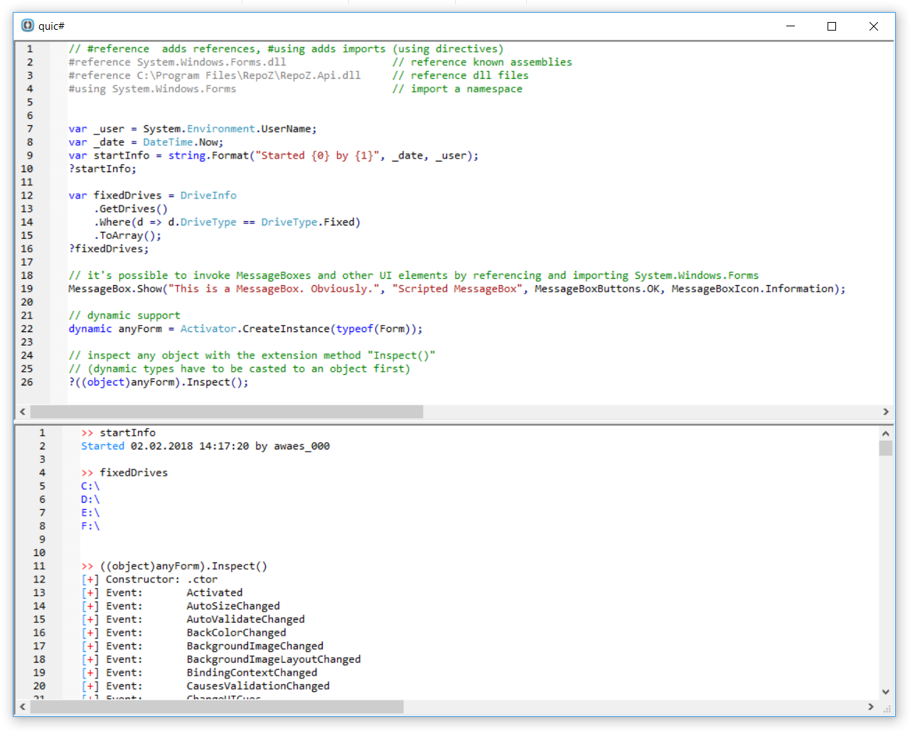

# quic#
A very simple scripting app using an abstracted C# scripting engine powered by either ...
 - the [Roslyn Scripting API](https://github.com/dotnet/roslyn/wiki/Scripting-API-Samples) (.NET 4.6)
 - ScriptCs (.NET 4.5)
 - a self-written CodeDom scripting engine (.NET 3.5).

